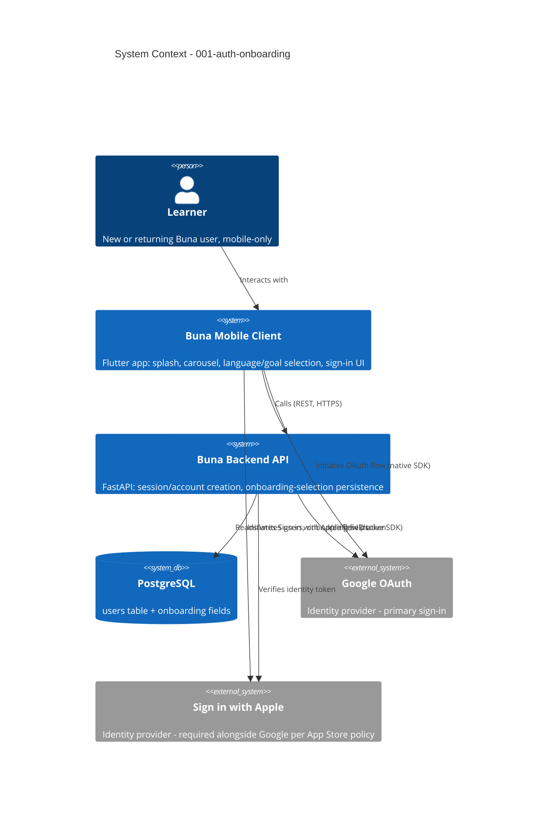

# Auth & Onboarding - System Context

## System Overview

The Buna mobile client (Flutter) walks a new user through a splash screen, onboarding carousel, and pre-auth language/daily-goal selection, then authenticates them via Google OAuth or Sign in with Apple against the FastAPI backend, which creates/loads the `users` row and attaches the pending onboarding selections on first successful auth.

## Context Diagram

## External Integrations

- **Google OAuth**: Primary sign-in provider. Mobile client obtains an ID token via the native Google Sign-In SDK; backend verifies it server-side before creating/loading the account.
- **Sign in with Apple**: Required alongside Google per App Store Review Guideline 4.8. Same verify-then-create/load pattern, using Apple's stable user identifier (not email) for account dedup.

No other external systems are in scope for this intent — Redis, Celery, and Cloudflare R2 (from the project's overall tech stack) are not touched by auth/onboarding itself.

## High-Level Constraints

- OAuth-only authentication in Phase 1 — no email/password flow, no backend-side password storage.
- Must run against the project's chosen stack: FastAPI + PostgreSQL (backend), Flutter/Dart (mobile client) — see `memory-bank/standards/tech-stack.md`.
- Onboarding selections (language, daily goal) must exist as pre-auth client state and attach atomically to the account on first successful sign-in (resolved in requirements.md).

## Key NFR Goals

- Session tokens stored in platform secure storage (Keychain/Keystore), never plain prefs.
- OAuth tokens and identity payloads are never logged (ties to `coding-standards.md` logging rules).
- Pending onboarding selections must survive the OAuth browser-handoff (app backgrounding/kill) without loss.
