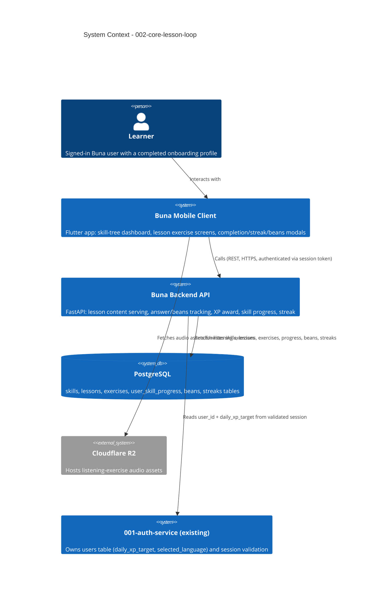

# Core Lesson Loop - System Context

## System Overview

A signed-in, onboarded Buna user lands on the skill-tree home dashboard, taps an unlocked skill node, and takes a lesson made up of multiple-choice, listening, and sentence-construction exercises served by a new backend lesson service. Wrong answers consume "Beans" (hearts); finishing a lesson awards XP toward the account's daily goal, updates skill progress/crown level, and updates the daily streak. Builds directly on `001-auth-onboarding`'s `users` table (`daily_xp_target`, `selected_language`) and session mechanism.

## Context Diagram

## External Integrations

- **Cloudflare R2**: Hosts audio files for listening/audio-matching exercises. Mobile client fetches audio directly by URL; backend only serves the URL as part of lesson content, per `memory-bank/standards/tech-stack.md`.
- **001-auth-service (internal, existing)**: Not a third-party integration, but a hard internal dependency — every lesson-service endpoint requires a valid session token (from `001-auth-onboarding`) to resolve the acting `user_id`, and reads `daily_xp_target`/`selected_language` from the existing `users` row rather than duplicating them.

No other external systems are in scope for this intent — Redis/Celery (background job infrastructure from the overall tech stack) are not required for bean regeneration in this intent's scope (regen is computed on read from a timestamp, not a scheduled job — see Technical Design for the exact approach).

## High-Level Constraints

- Every lesson-service endpoint is authenticated via the existing session-token mechanism from `001-auth-onboarding` — no new auth scheme.
- Must run against the project's chosen stack: FastAPI + PostgreSQL (backend), Flutter/Dart (mobile client) — see `memory-bank/standards/tech-stack.md`. Local dev/test uses SQLite per `data-stack.md`, same as `001-auth-service`.
- Lesson content (all exercises for a lesson) must be fetchable in a single request — no per-exercise round trip (performance NFR from requirements.md).

## Key NFR Goals

- Mid-lesson app kill/background never crashes the app and never double-awards XP on resume/retry.
- Exercise-to-exercise transitions are instant (lesson content cached client-side after the single fetch).
- Listening-exercise audio assets are served from Cloudflare R2, not bundled in the app binary.
