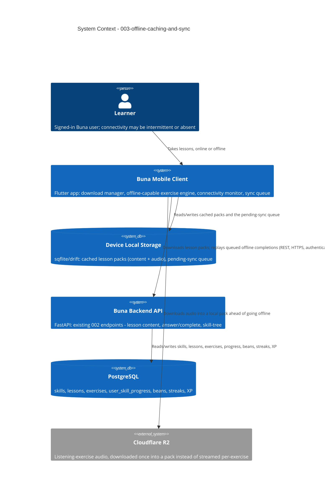

# Offline Caching & Sync - System Context

## System Overview

A signed-in Buna user downloads a skill's lesson pack (content + audio) ahead of time, then can take those lessons with zero connectivity — same exercise engine, same client-side grading, same Beans/streak/XP bookkeeping as `002-core-lesson-loop`, just held in local device storage instead of reaching the server immediately. Once connectivity returns, a sync engine on the mobile client replays every locally recorded completion through the same backend endpoints `002` already built, relying on their existing `attemptId` idempotency guarantee (ADR-5) rather than any new sync-specific backend machinery. Almost all of this intent's new surface area is on the mobile client (download manager, local storage, connectivity monitor, sync queue) — the backend's role is largely unchanged.

## Context Diagram

## External Integrations

- **Cloudflare R2**: Same source as `002`, but the client now proactively downloads and caches each lesson's audio into the local pack up front, instead of streaming it per-exercise at lesson time.
- **002-core-lesson-loop (internal, existing)**: Not a new service boundary — this intent reuses `002`'s lesson-content, answer, and completion endpoints unchanged. "Sync" is simply those same calls, made later, already safe to retry/replay because bolt 005's completion endpoint is `attemptId`-idempotent (ADR-5). No parallel backend sync service is introduced.

No other external systems are in scope — this intent does not touch auth (`001`), payments, or notifications.

## High-Level Constraints

- No new auth scheme — sync calls reuse the same session-token mechanism as `001`/`002`.
- No new backend endpoint is assumed necessary for the core sync path (FR-3), since the existing completion endpoint already tolerates retries/replays; Technical Design should confirm whether a batch-sync endpoint (multiple queued completions in one call) is worth adding for network efficiency, versus calling the existing endpoint once per queued item.
- Local storage (lesson packs + pending-sync queue) must survive app restart and OS kill — same durability bar as the Reliability NFR in `requirements.md`.
- The 14-day pack staleness re-check (FR-1) piggybacks on the existing skill-tree/lesson-content fetch; it does not assume a new content-versioning endpoint unless Technical Design finds the current response has no usable version/etag field to compare against.

## Key NFR Goals

- Zero network calls while taking an already-downloaded lesson — identical to `002`'s existing online performance NFR.
- Sync is fully automatic and idempotent: no user action to trigger it, and no duplicate XP/Beans on a retried or replayed completion.
- Nothing in the pending-sync queue is ever silently dropped, no matter how long the device stays offline.
