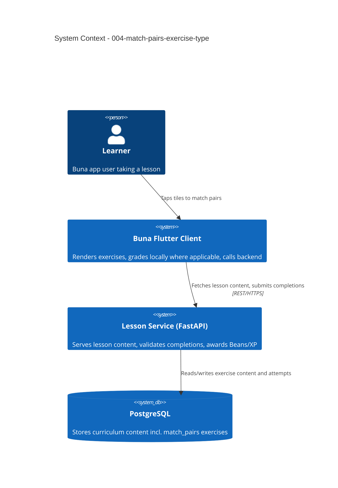

# Match-Pairs Exercise Type - System Context

## System Overview

Extends the existing lesson engine (backend `001-lesson-service` + Flutter `002-core-lesson-loop-ui`) with a 4th exercise type. No new actors or external systems — this intent operates entirely within the system boundary already established by `002-core-lesson-loop` and `003-offline-caching-and-sync`.

## Context Diagram

## External Integrations

None new. Reuses the existing backend REST API and PostgreSQL store.

## High-Level Constraints

- Must slot into the existing `ExerciseType` dispatch pattern on both backend and client — no parallel exercise-rendering pipeline.
- Must remain compatible with `003-offline-caching-and-sync`'s download/offline-take path with zero changes to that unit's code (text-only content requires no new download logic).

## Key NFR Goals

- Zero added network round-trips per tap (grading interaction is client-side/local, matching the other 3 exercise types).
- No regression to existing exercise types' behavior or response shape.
