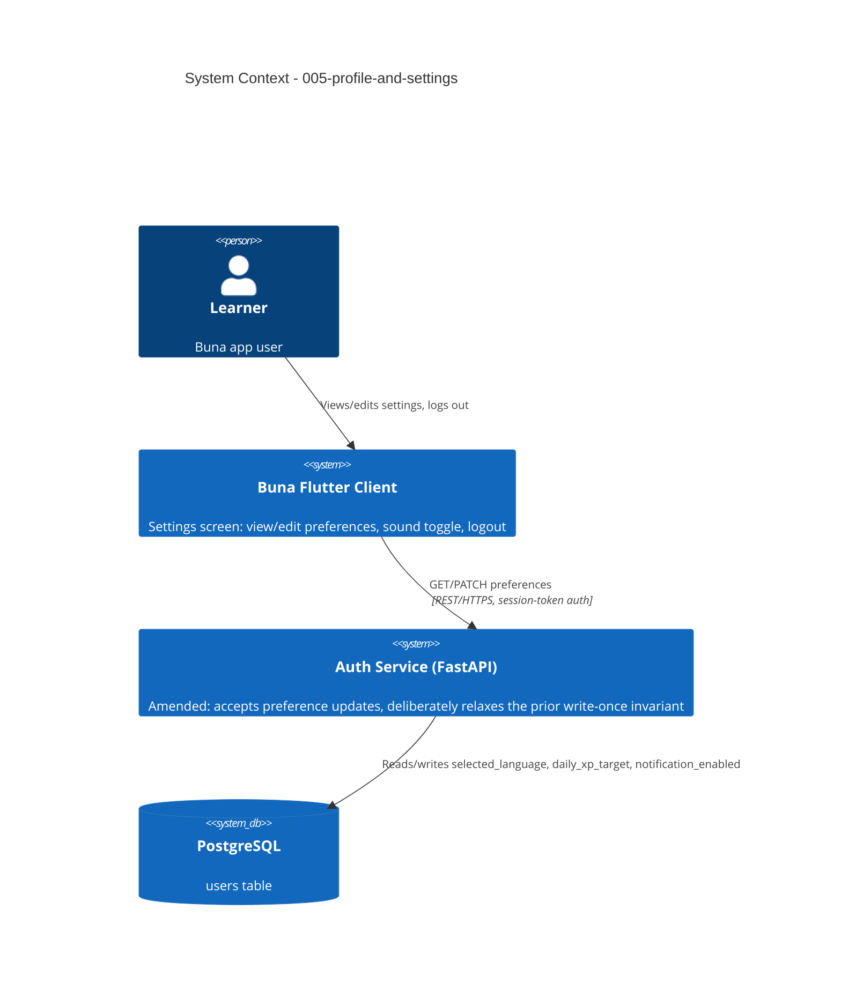

# Profile & Settings - System Context

## System Overview

Extends the existing auth bounded context (`001-auth-service`) with one new capability — updating a user's preferences after account creation — plus a new Flutter Settings screen. No new actors or external systems.

## Context Diagram

## External Integrations

None new.

## High-Level Constraints

- Amends `001-auth-service` rather than creating a new bounded context — same pattern `001-offline-sync-service` used amending `001-lesson-service`.
- The prior "written exactly once at creation" invariant on `selected_language`/`daily_xp_target` must be formally amended (documented, likely ADR-worthy), not silently bypassed.

## Key NFR Goals

- Same session-token auth as every other endpoint — no new auth mechanism.
- No name/email/avatar data introduced — the domain model's actual shape is respected, not expanded speculatively.
