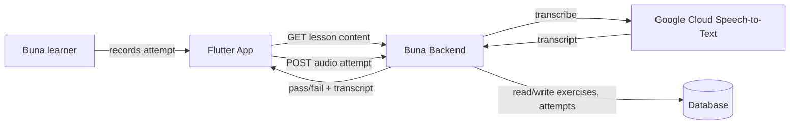

# System Context: speak-check-exercise-type

## Overview

Extends `002-core-lesson-loop`'s exercise-type dispatch (client) and `001-lesson-service`'s polymorphic `exercises` table (backend, ADR-3). Introduces exactly one new external system: **Google Cloud Speech-to-Text**, this codebase's first metered, per-request-billed external dependency (Google/Apple OAuth verification, the only other external calls, are free).

No new actors. No new user-facing account/session concept.

## Actors

- **Buna learner** (existing) — records a spoken attempt instead of tapping/typing.

## Systems

| System | Type | New? | Notes |
|--------|------|------|-------|
| Buna Flutter app | Internal | No | New recording widget + audio-recording package (not yet in `pubspec.yaml`) |
| Buna backend (`001-lesson-service`) | Internal | No | New endpoint + `exercises` table CHECK-constraint widening (ADR-3 pattern, per `011-match-pairs-service` precedent) |
| Google Cloud Speech-to-Text | External | **Yes** | First metered external API in this codebase. Requires GCP project/billing — not yet provisioned (see requirements.md's Constraints) |

## Diagram

## Amendments to Existing Systems

- **`exercises` table** (ADR-3): `ck_exercises_type` CHECK constraint widened to include `speak_check`, via a new Alembic migration — same pattern as `011-match-pairs-service`'s `c726efa81972`.
- **`LessonPackDownloader`** (`003-offline-caching-and-sync`): must handle a `speak_check` exercise without crashing, and per FR-5, exclude it from offline availability (exact granularity deferred to Technical Design).
- **Grading architecture** (ADR-5): this is the first exercise type where grading is *not* client-side. Flagged prominently in requirements.md's FR-2 — a new ADR is expected at Construction, not a silent exception.

## Constraints Carried Forward

- Construction should not begin on this intent's backend unit until Google Cloud Speech-to-Text is actually provisioned (account, project, billing, API credentials) — see requirements.md's Assumptions.
