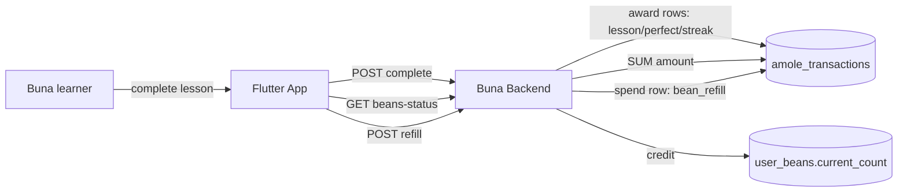

# System Context: amole-currency

## Overview

Amends `005-lesson-engagement-service` (backend: `UserBeans`, `complete_lesson`, `refill_beans_with_amole`) and `006-core-lesson-loop-ui`/`007-core-lesson-loop-ui` (frontend: dashboard, `OutOfBeansSheet`). No new external system, no new actor — purely an internal ledger retrofit plus new award triggers and one new UI element.

## Actors

- **Buna learner** (existing) — earns Amole passively by playing lessons; spends it (unchanged) on Bean refills.

## Systems

| System | Type | New? | Notes |
|--------|------|------|-------|
| Buna Flutter app | Internal | No | New dashboard balance display only — `OutOfBeansSheet` is already correct and unchanged |
| Buna backend (`001-lesson-service` / `005-lesson-engagement-service`) | Internal | No | New `amole_transactions` table + migration; `complete_lesson` gains award side-effects; `refill_beans_with_amole` and the beans-status endpoint are retrofitted to read/write the ledger instead of a column |

## Diagram

## Amendments to Existing Systems

- **`user_beans` table**: `amole_balance` column removed. Balance moves entirely to the new `amole_transactions` table.
- **`complete_lesson` use case** (`005-lesson-engagement-service`): gains Amole-award side effects (flat + perfect-lesson bonus), still one transaction, still idempotent on `attempt_id`.
- **`refill_beans_with_amole` use case**: internal retrofit only — posts a ledger row instead of mutating a column. Request/response contracts unchanged.
- **Skill-tree dashboard** (`006-core-lesson-loop-ui`): new balance display, sourced from the existing beans-status endpoint (already fetched for the Beans HUD — no new network call).

## Constraints Carried Forward

- Zero regression to any of bolt `005`'s or `006`/`007`'s existing tests.
- Migration must preserve existing users' balances exactly (backfill, not reset to zero).
