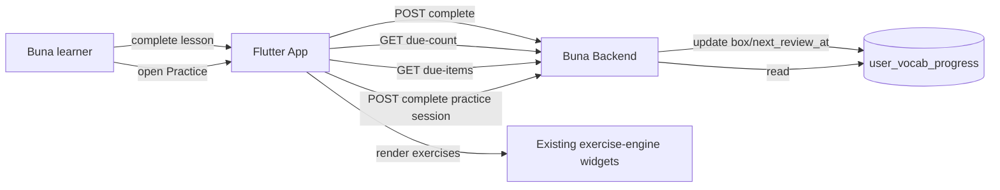

# System Context: srs-and-practice

## Overview

Extends `001-lesson-service`'s content model (new `vocab_items` table, new nullable FK on `exercises`) and retrofits `005-lesson-engagement-service`'s `complete_lesson` with vocab-progress side-effects. Adds a new client entry point reusing the existing exercise-engine UI. No new external system.

## Actors

- **Buna learner** (existing) — reviews due vocabulary instead of only progressing forward through the skill tree.

## Systems

| System | Type | New? | Notes |
|--------|------|------|-------|
| Buna Flutter app | Internal | No | New Practice entry point + due-count badge, reusing existing exercise-engine widgets; exact navigation mechanism is a Technical Design decision (no tabbed shell exists today) |
| Buna backend (`001-lesson-service` / `005-lesson-engagement-service`) | Internal | No | New `vocab_items`/`user_vocab_progress` tables, `exercises.vocab_item_id` FK, `complete_lesson` retrofit, new due-items/due-count endpoints |

## Diagram

## Amendments to Existing Systems

- **`exercises` table**: new nullable `vocab_item_id` FK to a new `vocab_items` table.
- **`complete_lesson` use case** (`005-lesson-engagement-service`): gains vocab-progress side effects, composed with the existing idempotency/offline-replay guarantees.
- **Offline sync** (`003-offline-caching-and-sync`): a delayed offline lesson completion must update vocab progress exactly once on replay — same discipline already applied to XP/Beans.
- **App navigation** (`main.dart`): gains a new entry point; exact mechanism (tab vs. dashboard element) deferred to Technical Design since no tabbed shell exists today.

## Constraints Carried Forward

- Zero regression to existing lesson-completion, offline-sync, and exercise-rendering behavior.
- No new exercise-rendering widgets.
