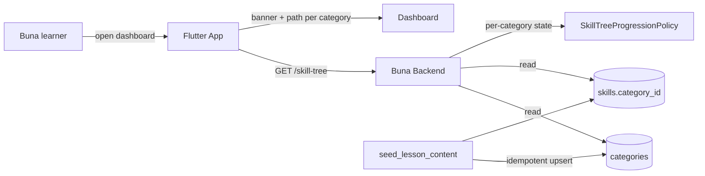

# System Context: course-categories

## Overview

Adds a category (unit) level above skills in `001-lesson-service`'s content model, makes skill progression category-aware, exposes categories through `GET /skill-tree`, and groups the Flutter dashboard by category. Adds four seeded categories of real Amharic content. No new external system.

## Actors

- **Buna learner** (existing) — chooses among several course categories on one dashboard instead of a single linear path.

## Systems

| System | Type | New? | Notes |
|--------|------|------|-------|
| Buna backend (`001-lesson-service`) | Internal | No | New `categories` table, `skills.category_id` FK, category-aware progression, skill-tree response carries categories, expanded seed |
| Buna Flutter app | Internal | No | `SkillTree` model gains categories; dashboard renders one banner + skill path per category |

## Diagram

## Amendments to Existing Systems

- **`skills` table**: new NOT NULL `category_id` FK; migration backfills the two existing skills into "Foundations & Greetings".
- **`SkillTreeProgressionPolicy` / `LessonCompletionService`** (`domain/lesson/services.py`): the "first skill active" bootstrap and the "unlock next skill" step move from global order to per-category order.
- **`get_skill_tree`** (`lesson_use_cases.py`): the hardcoded `UNIT_TITLE`/`UNIT_SUBTITLE` are replaced by real category data; query count must stay constant.
- **`SkillTreeResponse`** and the Flutter `SkillTree` model / `HttpLessonApi` / `FakeLessonApi`: carry categories.
- **Dashboard** (`skill_tree_dashboard_screen.dart`): `_UnitBanner` becomes per-category.

## Unchanged by design

- SRS/Practice (008), offline packs (003), Beans/XP/Amole/streak: keyed off lessons/exercises, so new content flows through untouched.

## Constraints Carried Forward

- Zero regression to existing lesson-taking, offline sync, Practice, and Amole behavior.
- Migration must be non-destructive and reversible on a database with existing users and progress.
