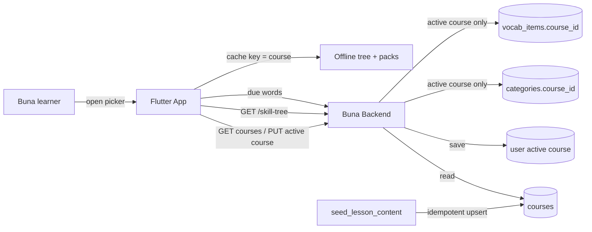

# System Context: multi-language-courses

## Overview

Adds a **course** level (a learning-language / from-language pair) above categories, stores one active course per user on the server, scopes the skill tree, progress, Practice and offline data to that course, and adds a course switcher and an onboarding language pair to the Flutter app. Seeds three Afaan Oromo starter courses. No new external system.

## Actors

- **Buna learner** (existing): picks a course from a list and switches between courses. May speak Amharic, Afaan Oromo or English as the from-language.
- **New learner in onboarding** (existing): now states "I speak" and "I want to learn".

## Systems

| System | Type | New? | Notes |
|--------|------|------|-------|
| Buna backend (`001-lesson-service` and auth/user service) | Internal | No | New `courses` table, `categories.course_id`, active course per user, course list/switch endpoints, course-scoped skill tree and Practice, expanded seed, signup accepts the pair |
| Buna Flutter app | Internal | No | Course switcher chip and picker, Settings picker, onboarding pair, course-keyed skill-tree cache and lesson packs |

## Diagram

## Amendments to Existing Systems

- **`categories` table**: new NOT NULL `course_id` FK; migration backfills all five categories into course English to Amharic.
- **`vocab_items` / Practice queries** (`lesson_repositories.py`): due items and due count filtered by the active course.
- **`users.selected_language`** and `LanguageCode` / `SUPPORTED_LANGUAGE_CODES`: superseded by the active course; exact handling decided in Technical Design.
- **`get_skill_tree`** (`lesson_use_cases.py`): reads the active course's categories only, constant query count.
- **Registration flow and `PendingOnboardingSelection`**: carry the language pair.
- **Flutter**: `language_selection_screen.dart` and `settings_screen.dart` hardcoded lists replaced by the course API; dashboard top bar gains the switcher; offline skill-tree cache and `LessonPackStore` keyed by course.

## Unchanged by design

- XP, streak, Beans, Amole (account-wide); lesson-taking, exercise widgets, sync queue mechanics; interface language (English).

## Constraints Carried Forward

- Zero regression to the English to Amharic course.
- Migration non-destructive and reversible on a database with users and progress.
- Skill-tree, course-list and Practice reads keep constant query counts.
- Agent-authored Afaan Oromo/Amharic content is not native-reviewed (NFR-3).
