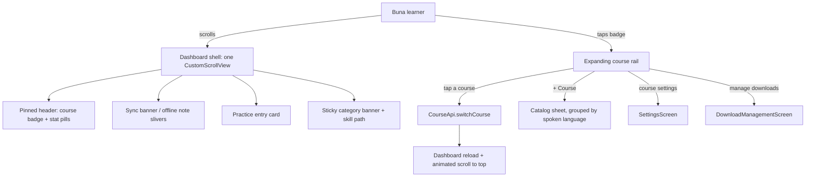

# System Context: dashboard-ui-polish

## Overview

Restructures the Flutter dashboard shell so the skill path is the dominant element: the
stats move into a pinned header, the page becomes one smooth scroll surface with sticky
category banners, and course selection, adding a course and course settings collapse into
one control in that header. No backend, API, schema or model change. No new external
system, no new dependency.

## Actors

- **Buna learner** (existing): reads their stats at any scroll position, knows which
  section they are in, and switches or adds a course from one place.

## Systems

| System | Type | New? | Notes |
|--------|------|------|-------|
| Buna Flutter app | Internal | No | Dashboard shell rebuilt as a sliver layout; `LessonHud` relocated; course chip becomes a badge with an expanding rail; catalog sheet rebuilt; Settings and Manage Downloads relocated |
| Buna backend | Internal | No | **Untouched.** Existing `GET /courses`, `PUT /users/me/active-course` and `GET /skill-tree` are consumed as they are |

## Diagram

## Amendments to Existing Systems

- **`skill_tree_dashboard_screen.dart`**: the `Column` + `Expanded(CustomScrollView)`
  becomes one `CustomScrollView`; `LessonHud` moves from the scroll body into a pinned
  header sliver; `SyncStatusBanner` and `_OfflineNote` become slivers; `_CourseChip`
  becomes the course badge that drives the rail; the two `IconButton`s leave the top bar.
- **`_CategorySection` / `_CategoryBanner`**: the banner becomes a pinned sliver per
  category; the nodes become that category's sliver body. Node visuals unchanged.
- **`course_picker.dart`**: `CoursePickerSheet` regrouped by the language the learner
  speaks and restyled; `pickAndSwitchCourse` keeps its contract so Settings is unaffected.
- **New widgets** under `lib/features/courses/`: the course badge, the rail and its tiles.
- **Tests**: `skill_tree_dashboard_screen_test`, `..._categories_test`,
  `..._course_chip_test`, `..._offline_test`, `course_picker_test` and
  `lesson_hud_narrow_test` are updated to the new structure, not deleted.

## Unchanged by design

- All backend behaviour; `CourseApi`, `CachingCourseApi`, `CourseCacheStore` and the
  ADR-14 offline rules; `SkillPathNode` visuals and the serpentine path; the Practice
  card's states; the sync queue; `SettingsScreen`'s own layout; lesson screens.

## Constraints Carried Forward

- ADR-14's offline rules must keep holding: cached fallback with the saved-progress note,
  the pending-switch sync before each load, and the uncached-course refusal message.
- Highland Pulse tokens only (`AppColors`, `AppSpacing`, `AppRadii`, `AppTypography`).
- No overflow at 320dp and 360dp with 1.3x text.
- The course list is always the API's, never hardcoded (intent 010, FR-7).
