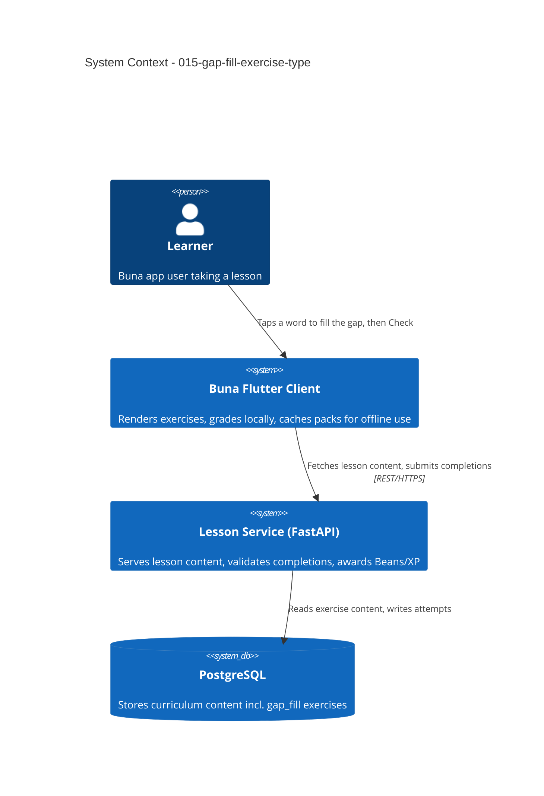

# Gap-Fill Exercise Type - System Context

## System Overview

Extends the existing lesson engine (backend `001-lesson-service` + Flutter `002-core-lesson-loop-ui`) with a fifth exercise type. No new actors and no new external systems — this intent operates entirely inside the boundary already established by `002-core-lesson-loop`, `003-offline-caching-and-sync` and `010-multi-language-courses`.

It is the narrowest kind of change this system supports: a new value in a closed enum, a new variant of an existing polymorphic row (ADR-3), and a new arm in two sealed-class switches on the client.

## Context Diagram

## Affected Seams

Adding an exercise type touches a fixed, known set of places. This list is the one bolt 011 walked for `match_pairs` and is reproduced here so neither bolt has to rediscover it:

**Backend**
| Seam | File |
|------|------|
| Type enum | `backend/app/domain/lesson/value_objects.py` (`ExerciseType`) |
| Content value object + `ExerciseContent` union | same file |
| Answer key | **none** — reuses `ChoiceAnswerKey`, no union change |
| CHECK constraint | `backend/app/infrastructure/db/lesson_models.py` (`ck_exercises_type`) |
| Migration | new revision, `op.batch_alter_table` (SQLite cannot alter a CHECK in place) |
| JSON → domain reconstruction | `backend/app/infrastructure/db/lesson_repositories.py` |
| Response schema + union | `backend/app/infrastructure/api/lesson_schemas.py` |
| Domain → response mapping | `backend/app/infrastructure/api/exercise_mapping.py` |
| Seed content | `backend/app/infrastructure/db/seed_lesson_content.py`, `seed_course_content.py` |
| Schema doc (declared source of truth) | `database-schema.md` |

**Client**
| Seam | File |
|------|------|
| Sealed subclass + `isAnswerCorrect` arm | `lib/shared/models/exercise.dart` |
| API parsing | `lib/shared/services/http_lesson_api.dart` (`_toExercise`) |
| Offline pack **serialize and deserialize** | `lib/shared/services/lesson_pack_store.dart` |
| Fake API | `lib/shared/services/fake_lesson_api.dart` |
| Body switch + `canSubmit` switch | `lib/features/lesson/screens/lesson_screen.dart` |
| New widget | `lib/features/lesson/widgets/` |

The sealed class makes most omissions compile errors. The one that does **not** is `lesson_pack_store.dart`, whose JSON map/case handling fails at runtime instead — which is why FR-3 calls it out explicitly.

## External Integrations

None new. Reuses the existing backend REST API and PostgreSQL store. No audio, no speech service, no new packages on either side.

## High-Level Constraints

- Must slot into the existing `ExerciseType` dispatch on both sides — no parallel exercise-rendering pipeline.
- Must remain compatible with `003-offline-caching-and-sync`'s download/offline-take path. Content is text-only, so this should hold by construction.
- Must remain compatible with `010-multi-language-courses`: content is seeded per course, in all four courses, through the existing idempotent loop.
- Seeding into existing lessons bumps `LessonModel.updated_at`, which feeds `content_version` and **invalidates already-downloaded offline packs**. Expected and acceptable; worth stating so it is not mistaken for a bug during verification.

## Key NFR Goals

- Zero added network round-trips per interaction (grading is local, matching all four existing types).
- No regression to existing exercise types' behaviour or response shape.
- No new member in the `AnswerKey` union — a stated goal of this intent, not an incidental detail.
