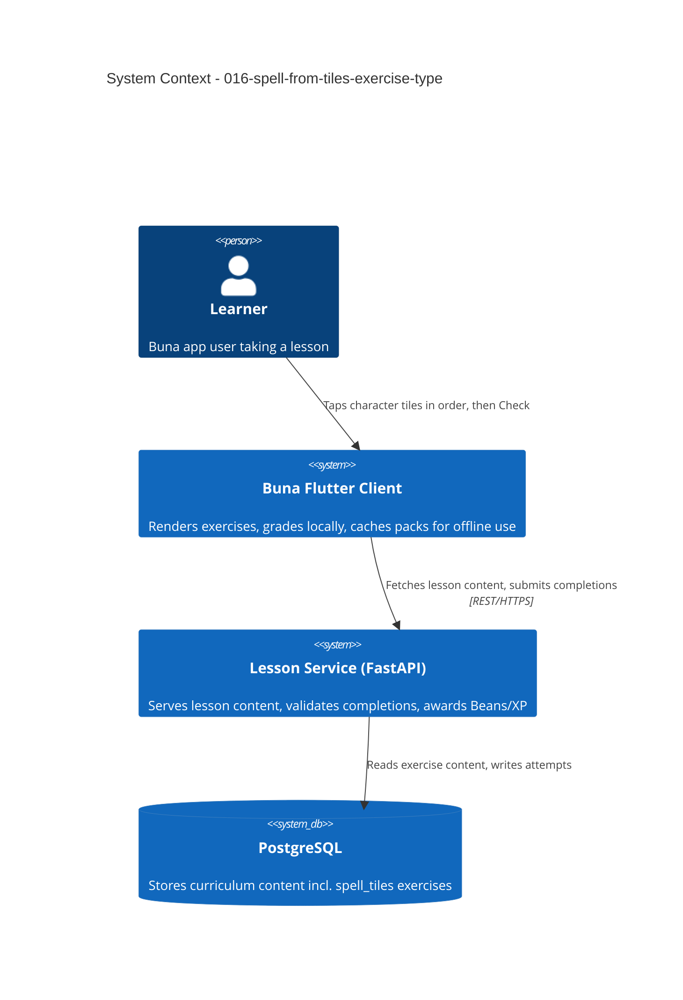

# Spell-From-Tiles Exercise Type - System Context

## System Overview

Extends the existing lesson engine (backend `001-lesson-service` + Flutter `002-core-lesson-loop-ui`) with a sixth exercise type. No new actors and no new external systems — this intent operates entirely inside the boundary already established by `002-core-lesson-loop`, `003-offline-caching-and-sync` and `010-multi-language-courses`.

On the backend it is the same narrow change `015` was: a new value in a closed enum, a new variant of an existing polymorphic row (ADR-3), an existing answer key reused. **On the client it is not.** The existing tap-tiles-in-order interaction is keyed by tile text, and spelling repeats characters where sentences do not repeat words, so this intent adds a genuinely new widget rather than an arm on an existing one. That asymmetry is the shape of the work.

## Context Diagram

## Affected Seams

The same fixed list `011` walked for `match_pairs` and `030`/`031` walked for `gap_fill`, reproduced so neither bolt has to rediscover it. The **⚠️ rows are where this type differs from `gap_fill`**.

**Backend**
| Seam | File |
|------|------|
| Type enum | `backend/app/domain/lesson/value_objects.py` (`ExerciseType`) |
| Content value object + `ExerciseContent` union | same file |
| Answer key | **none** — reuses `SequenceAnswerKey`, no union change |
| CHECK constraint | `backend/app/infrastructure/db/lesson_models.py` (`ck_exercises_type`) — declared in two places |
| Migration | new revision on `d1b7e4f2a903`, `op.batch_alter_table` |
| JSON → domain reconstruction | `backend/app/infrastructure/db/lesson_repositories.py` — note `_answer_key_from_json` already handles `correct_sequence`; the fall-through in `_content_from_json` must stay guarded |
| Response schema + union | `backend/app/infrastructure/api/lesson_schemas.py` |
| Domain → response mapping | `backend/app/infrastructure/api/exercise_mapping.py` |
| ⚠️ Seed content | `seed_lesson_content.py`, `seed_course_content.py` — **must not reuse `_choices` or the `id_by_token` idiom**, both of which key by tile text and collapse duplicate characters |
| Schema doc (declared source of truth) | `database-schema.md` |
| Dispatch test | `backend/tests/unit/test_exercise_type_dispatch.py` — parametrized over `ExerciseType`, so it fails the moment `SPELL_TILES` joins the enum. That is the intended alarm, not a break |

**Client**
| Seam | File |
|------|------|
| Sealed subclass + `isAnswerCorrect` arm | `lib/shared/models/exercise.dart` |
| ⚠️ API parsing | `lib/shared/services/http_lesson_api.dart` — `sentence_construction`'s branch flattens tile ids to text; this type must **keep** ids |
| Offline pack **serialize and deserialize** | `lib/shared/services/lesson_pack_store.dart` — now four top-level functions with a round-trip harness, courtesy of bolt `031` |
| Fake API | `lib/shared/services/fake_lesson_api.dart` |
| Body switch + `canSubmit` switch | `lib/features/lesson/screens/lesson_screen.dart` |
| ⚠️ New widget | `lib/features/lesson/widgets/` — a **new** id-keyed sibling of `word_bank_builder.dart`, which is not modified |

The sealed class makes most omissions compile errors. The one that does **not** is `lesson_pack_store.dart`, whose read half is a switch over a string. `031` proved this by removing a case and watching it compile and then fail at runtime; the harness it built makes covering this type cheap.

## External Integrations

None new. Reuses the existing backend REST API and PostgreSQL store. No audio, no speech service, no new packages on either side. Fidel characters split on Dart's default grapheme boundaries — no text-segmentation package is needed.

## High-Level Constraints

- Must slot into the existing `ExerciseType` dispatch on both sides — no parallel exercise-rendering pipeline.
- Must remain compatible with `003-offline-caching-and-sync`'s download/offline-take path. Content is text-only, so this should hold by construction.
- Must remain compatible with `010-multi-language-courses`: seeded per course, in all four, through the existing idempotent loop.
- **Tile identity is by id throughout.** Any place that keys a tile by its text is a defect for this type, on either side of the wire.
- Seeding into existing lessons bumps `LessonModel.updated_at`, which feeds `content_version` and **invalidates already-downloaded offline packs**. Expected; stated so it is not mistaken for a bug during verification.

## Key NFR Goals

- Zero added network round-trips per interaction (grading is local, matching all five existing types).
- No regression to existing exercise types' behaviour or response shape — and specifically, `sentence_construction` is not touched at all.
- No new member in the `AnswerKey` union — the second consecutive type to manage this, and a stated goal rather than an incidental detail.
