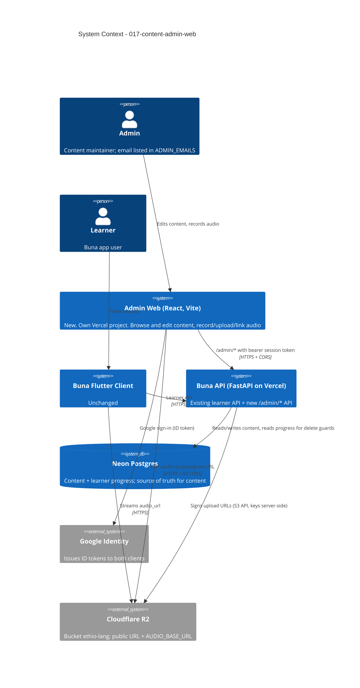

# Content Admin Web - System Context

## System Overview

Adds a **second client** to the existing FastAPI backend: a React admin site
that writes the content tables the Flutter app already reads. It brings one
new actor (the admin), one new client (the admin site), and makes Cloudflare
R2 an integration the backend talks to directly. Before this intent, R2 was
only a place where files were put by hand.

The learner side is unchanged. The Flutter app, the learner API
(`/skill-tree`, `/lessons/{id}`, `/courses`, `/practice/*`) and all
gamification logic are untouched. Admin edits reach learners only because both
clients read and write the same rows.

## Context Diagram

## Actors

| Actor | Access | Notes |
|-------|--------|-------|
| Admin | `/admin/*`, R2 uploads via presigned URL | One to three people. Identified by email in `ADMIN_EMAILS` |
| Learner | Learner API only | A learner who is also an admin sees nothing different in the app |

## External Integrations

| System | Direction | Purpose | New? |
|--------|-----------|---------|------|
| Google Identity | Admin web → Google → backend verifies | Admin sign-in | Reused; needs the admin origin added to the web OAuth client's authorised JavaScript origins |
| Cloudflare R2 (S3 API) | Backend → R2 | Presign PUT URLs | **New** for the backend (boto3 or equivalent; keys `R2_*` already in `.env.example`) |
| Cloudflare R2 (public URL) | Browser → R2, app → R2 | Upload bytes; stream clips | **New** CORS rule on bucket `ethio-lang` for the admin origin |
| Arbitrary https hosts | Backend → host | Check a pasted audio link answers with an audio content type (FR-5) | **New**, outbound fetch with a short timeout |

## Pre-Construction Findings

These come from reading the code. Record them here so Construction does not
have to find them again.

1. **The backend does not store email.** `users` holds only `auth_provider` +
   `provider_user_id` (the Google `sub`). `ADMIN_EMAILS` can only be checked
   against the email in the verified Google ID token at sign-in time. FR-1's
   "revoked on the next request" therefore needs the verified email kept
   somewhere per session or per user. **Decide at the Plan stage of bolt
   `034`**. The likely answer is a nullable `email` column, written from the
   verified token on every Google sign-in and checked only when
   `email_verified` is true.
2. **One Google audience is configured.** `GoogleTokenVerifier` checks a
   single `google_oauth_client_id`. The Flutter Android sign-in normally
   requests ID tokens for the *web* client id (`serverClientId`). If so, the
   admin site's Google Identity Services button can use the same client id
   and no verifier change is needed. Verify this; otherwise accept a list of
   audiences, as `apple_verifier.py` already does.
3. **CORS exists.** `cors_allowed_origins` in `config.py` already takes extra
   origins. The admin origin is added there, not hard-coded.
4. **The seeds upsert.** `seed_content` updates every row it owns. FR-6 turns
   this into insert-only, and the change applies to both
   `seed_lesson_content.py` and `seed_course_content.py`. Tests that expect a
   re-seed to fix content must be revisited, not deleted blindly.
5. **Validation already lives in the domain.** The content value objects in
   `app/domain/lesson/value_objects.py` and the JSON reconstruction in
   `lesson_repositories.py` are the rules FR-4 must reuse. There must be no
   second copy of per-type validation in the admin API.
6. **Learner history references content.** `lesson_attempts.lesson_id` and
   `user_skill_progress.skill_id` are foreign keys, so an unguarded delete
   fails at the database, or worse, cascades. FR-3's delete guard counts these
   rows first.
7. **The R2 public dev URL currently returns 404.** FR-5 cannot be verified
   end to end until bucket public access is fixed. This is not engineering
   work in this intent, but it blocks bolt `039`'s final check.

## Affected Areas

**Backend (`backend/`)**
| Area | Change |
|------|--------|
| `app/config.py` | `ADMIN_EMAILS`, `AUDIO_BASE_URL`, `R2_*` settings |
| `app/infrastructure/api/` | New `admin_routers.py`, `admin_schemas.py`, admin dependency (`require_admin`) |
| `app/application/` | Admin content use cases (create/update/reorder/delete, delete guard) |
| `app/infrastructure/external/` | New R2 presigner; audio-link checker |
| `app/infrastructure/db/` | Possible `email` column + migration; insert-only seeds |
| `main.py` | Mount the admin router |

**Admin web (`admin/`, new)**
| Area | Change |
|------|--------|
| Vite + React + TypeScript app | Sign-in, content tree, editors, audio, preview |
| Own Vercel project | `VITE_API_BASE_URL`, `VITE_GOOGLE_CLIENT_ID` |

**Not touched:** `lib/` (Flutter), `android/`, `ios/`, the learner routers.

## High-Level Constraints

- Admin writes must go through the same domain types the learner read path
  uses, so the app can never be served content it cannot render.
- Ids stay uuid5 for seeded rows; new rows use uuid4. The two cannot collide,
  so insert-only seeds and admin-created rows coexist.
- No secret reaches the browser. The admin site only needs a public Google
  client id and the API base URL.
