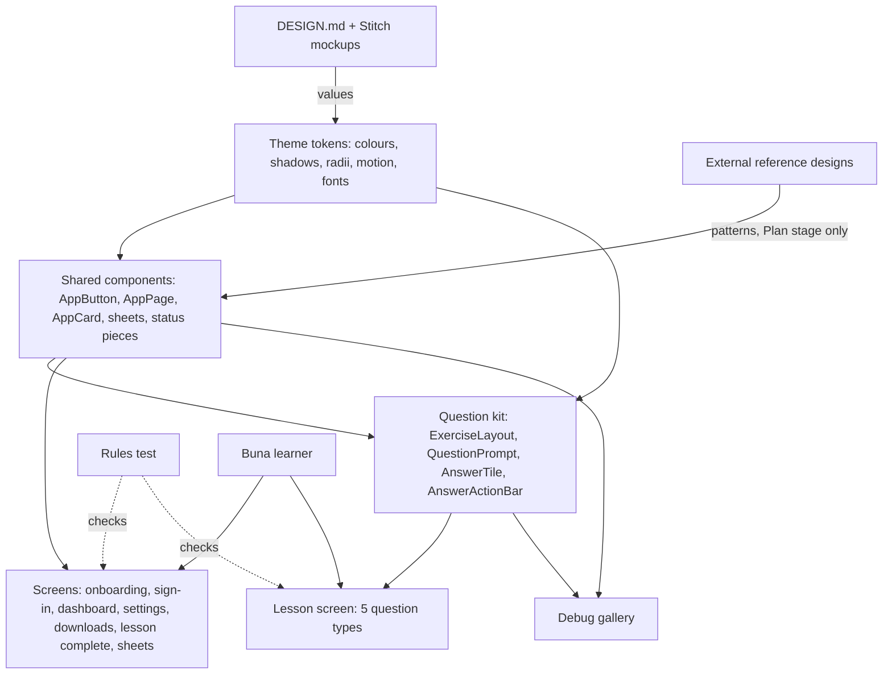

# System Context: mobile-design-system

## Overview

This intent changes only how the Flutter app draws itself. It adds:
- a shared component library (tokens, shadows, motion, buttons, page shell,
  cards, sheets, status pieces and a question-type kit)
- two bundled fonts
- a debug-only gallery
- a rules test that keeps screens on the library

It then moves every screen onto the library.

There is no backend, API, schema, model or controller change. The only new
external inputs are the two font files, and, while designing, the reference
designs that are studied (FR-11). Those references are never shipped or
called at run time.

## Actors

- **Buna learner** (existing): sees the same background, cards, buttons,
  sheets, prompts and answer tiles on every screen and in every question type.
- **Developer** (existing): builds new screens and question types from the
  library, checks them in the gallery, and is stopped by the rules test when a
  screen draws its own decoration.

## Systems

| System | Type | New? | Notes |
|--------|------|------|-------|
| Buna Flutter app | Internal | No | New `lib/shared/theme/` tokens, `lib/shared/widgets/` components, `lib/features/lesson/widgets/exercise/` kit and a debug gallery; every screen rebuilt on them |
| Bundled fonts | Asset | Yes | Plus Jakarta Sans (400/500/700/800) and Noto Sans Ethiopic, both SIL OFL, in `assets/fonts/` with their licence files |
| Stitch mockups and DESIGN.md | Design reference | No | `stich-screens/extracted/…`, read while designing only |
| External reference designs | Design reference | Yes | Studied during each bolt's Plan stage for screens with no mockup (FR-11). Only layout and interaction patterns are borrowed |
| Buna backend | Internal | No | **Untouched** |
| Admin site | Internal | No | **Untouched** |

## Diagram

## Data Flows

**Inbound**: none at run time. The font files are bundled at build time.

**Outbound**: none. No new network call, storage or analytics.

## Amendments to Existing Systems

- **`lib/shared/theme/`**:
  - new colour tokens in `app_colors.dart`
  - new files: `app_shadows.dart` and `app_motion.dart`
  - `AppRadii.tile` and `AppRadii.card`
  - `app_typography.dart` points at the bundled fonts with the Ethiopic fallback
- **`lib/shared/widgets/`**:
  - new: `AppButton`, `AppIconButton`, `AppPage`, `AppCard` and its family, `showAppSheet`/`showAppDialog`/`SheetHero`, and the status pieces
  - `TactileButton` and `SelectableOptionCard` become wrappers, or are replaced along with their tests
- **`lib/features/lesson/widgets/`**:
  - `ChoiceTile`, `_MatchPairsTileChip` and `_WordChip` give way to `AnswerTile`
  - `ExercisePromptHeader` gives way to `QuestionPrompt`
  - `GapSentence` and `WordBankBuilder` are rebuilt on the kit
- **Every screen file** listed in FR-8 drops its own decoration code.
- **`pubspec.yaml`**: a `fonts:` section and the font assets.
- **`test/`**: a new rules test, a gallery test and component tests. Existing tests change only where they find a widget by a type that is replaced.

## Unchanged by design

- `LessonController`, grading, the sounds and vibration, sync, caching, offline packs, sign-in, navigation and routes.
- Every API client, model and store.
- What each screen shows, and what each button does.

## Constraints Carried Forward

- ADR-14's offline rules and every existing behaviour test keep holding.
- No overflow at 360dp (and 320dp where earlier intents required it) with 1.3× text.
- Tap targets are at least 48dp, and semantics labels are kept.
