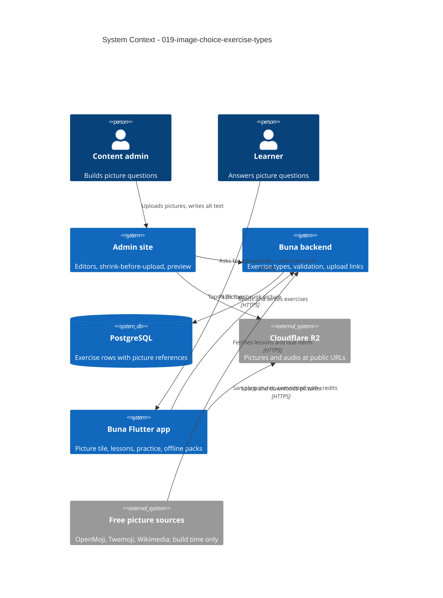

# System Context: image-choice-exercise-types

## Overview

Two new question types, `image_choice` and `audio_image_choice`, whose
answers are pictures. They reach every part of the system that an exercise
type touches, as `004`, `015` and `016` did. Unlike those, they also add a
new kind of media, pictures, which travels the path audio already uses:
admin upload link, storage, public URL, offline pack.

No new service or third-party system is called at run time. Picture sources
(OpenMoji, Twemoji, Wikimedia Commons) are used once, while building the
sample content, and their files are committed with their credits.

## Actors

- **Buna learner** (existing): answers picture questions in lessons,
  downloaded lessons and practice.
- **Content admin** (existing): builds picture questions in the admin site,
  uploading and describing each picture.
- **Owner** (existing): gives the go-ahead for the Neon migration, the
  production seed, uploads to production R2 and any R2 CORS change.

## Systems

| System | Type | New? | Role in this intent |
|--------|------|------|---------------------|
| Buna backend (FastAPI) | Internal | No | Two new exercise types, their validation, a picture upload link, and local picture storage in development |
| PostgreSQL: SQLite locally, Neon in production | Internal | No | `exercises.type` check widened by a migration. Neon only with the owner's go-ahead |
| Cloudflare R2 | External | No | Stores pictures beside the audio and serves them at public URLs. Web drawing needs CORS (finding 3) |
| Local media (`backend/media`) | Internal | No | Development storage, served at `/media`. Pictures go under `/media/images` |
| Admin site (React, `admin/`) | Internal | No | Two editors, a picture field that shrinks before upload, and a preview |
| Buna Flutter app | Internal | No | A picture tile in the question kit, both types in lessons and practice, offline packs, early loading, picture credits |
| Free picture sources | External, build time only | Yes | Sample pictures are chosen, downloaded, shrunk and committed once, with their licences |

## Context Diagram

## Data Flows

### Inbound
- **From the admin site:** exercise JSON with 2 to 4 choices of
  `{id, image_url, alt_text}`, plus a prompt, or an instruction and an
  `audio_url`. Validated field by field, with a `422` naming the field.
- **Upload link requests:** `{lesson_id, content_type, size}`. Only
  `image/webp` or `image/jpeg`, 1 byte to 1 MB.
- **Picture bytes:** a PUT straight to R2, or to the local backend in
  development, bound to the type and exact size.

### Outbound
- **Lesson and due-item responses:** the new types, with each picture
  reference an https URL, or in development a `/media/images/...` path that
  the app resolves against the API base, as it does for audio.
- **Pictures:** public URLs from R2 or `/media`, read by the app, the admin
  preview and offline downloads.

## Affected Seams

**Backend**
| Seam | File |
|------|------|
| Type enum, content value objects, `ExerciseContent` union | `backend/app/domain/lesson/value_objects.py` |
| Allowed keys and field checks | `backend/app/domain/lesson/exercise_parts.py` (`_CONTENT_KEYS`, a picture-choice check beside `_check_tiles`, the audio URL rule) |
| Answer key | **none new**: `ChoiceAnswerKey` |
| Check constraint and migration | `backend/app/infrastructure/db/lesson_models.py`, a new revision using `op.batch_alter_table` |
| JSON to domain | `backend/app/infrastructure/db/lesson_repositories.py` |
| Response schema and mapping | `lesson_schemas.py`, `exercise_mapping.py` |
| Upload link | `admin_audio_use_cases.py` pattern, `admin_routers.py`, `local_audio_storage.py`, `media.py` |
| Schema document | `database-schema.md` |

**Admin site**
| Seam | File |
|------|------|
| Type list and blank content | `admin/src/exercises/model.ts`, `AddExerciseMenu.tsx` |
| Editors | `ExerciseForm.tsx`, a new picture-choices editor beside `ChoicesEditor.tsx` |
| Upload | `admin/src/audio/upload.ts` pattern, a new picture module |
| Preview | `ExercisePreview.tsx` |

**App**
| Seam | File |
|------|------|
| Sealed subclasses and grading | `lib/shared/models/exercise.dart` |
| Parsing | `lib/shared/services/http_lesson_api.dart` |
| Offline pack: save, load, delete, size | `lesson_pack_store.dart`, `lesson_pack_downloader.dart` |
| Cached copy offline rule | `lesson_screen.dart` (finding 5) |
| Fake API and gallery | `fake_lesson_api.dart`, `lib/shared/gallery/` |
| Picture tile | `lib/shared/widgets/exercise/` |
| Prompt, answers and audio | `lesson_screen.dart` (`_promptFor`, `_answersFor`, `_clipOf`) |

## Findings

1. **Practice picks one question per word: the first by exercise id.**
   `list_exercises_by_vocab_item_ids` keeps the first row per word, ordered
   by id. A picture question linked to a word that already has another
   question may never be the one practice shows. The sample seed links each
   picture question to a word that has no other question, and a test on
   due items proves practice returns it.
2. **The app has no licences page today.** The picture credits story adds a
   "Licences" entry to settings that opens Flutter's licence page, with the
   picture credits registered beside the package licences.
3. **Flutter web needs CORS to draw pictures from R2.** Audio plays without
   it, but a picture drawn on the web canvas needs the bucket to send
   `Access-Control-Allow-Origin`. Checking is part of the upload link story;
   any change to the bucket waits for the owner.
4. **The offline pack handles audio only for listening questions.** Save,
   delete and the size shown on the downloads screen each check
   `ListeningExercise`. Each must also handle pictures, and the audio of
   `audio_image_choice`.
5. **A cached copy is used offline when it has no listening question.**
   That rule must also refuse copies holding either new type, so the
   learner sees "download required" instead of missing pictures.
6. **`backend/media` is git-ignored.** The sample pictures need a committed
   home, from which the local seed copies them into `backend/media/images`.

## Constraints

- One exercise-type dispatch on each side; no separate picture pipeline.
- No new answer key; grading stays on the device (ADR-5).
- The picture tile is built from the kit and Highland Pulse tokens, and the
  rules-test allow-list may not grow.
- Neon, production R2 and R2 CORS change only with the owner's go-ahead.
